<a name="top"></a>
# CARFAC Tests
These are test results derived from the google/carfac distribution when CARFAC_Test.m is run


These also include corresponding results from the julia port - they should be identical, apart from cosmetic diffrences


[Figure 1 - CAR Filters Linear Frequency Response](#Sect1)


[Figure 2 - "One Cap" (v1) IHC Response for tone blips at 300Hz](#Sect2)


[Figure 3 - "One Cap" (v1) IHC Response for tone blips at 3000Hz](#Sect3)


[Figure 4 - "Two Cap" (v2) IHC Response for tone blips at 300Hz](#Sect4)


[Figure 5 - "Two Cap" (v2) IHC Response for tone blips at 3000Hz](#Sect5)


[Figure 6 - "do_syn" (v3) IHC Response for tone blips at 300Hz](#Sect6)


[Figure 7 - "do_syn" (v3) IHC Response "class_firings" for tone blips at 300Hz](#Sect7)


[Figure 8 - "do_syn" (v3) IHC Response for tone blips at 3000Hz](#Sect8)


[Figure 9 - "do_syn" (v3) IHC "class_firings" Response for tone blips at 3000Hz](#Sect9)


[Figure 10 - Steady state spatial responses of the stages, default [8, 2, 2, 2] decimation](#Sect10)


[Figure 11 - Steady state spatial responses of the stages, simpler [8, 1, 1, 1] decimation](#Sect11)


[Figure 12 - Steady state spatial responses of the stages, no decimation](#Sect12)


[Figure 13 - test stage g calculation](#Sect13)


[Figure 14 - Whole CARFAC "one cap" (v1), decimating](#Sect14)


[Figure 15 - Whole CARFAC "one cap" (v1), decimating](#Sect15)


[Figure 16 - Whole CARFAC "one cap" (v1), decimating](#Sect16)


[Figure 17 - Whole CARFAC "two cap" (v2), decimating](#Sect17)


[Figure 18 - Whole CARFAC "two cap" (v2), decimating](#Sect18)


[Figure 19 - Whole CARFAC "two cap" (v2), decimating](#Sect19)


[Figure 20 - Whole CARFAC "do_syn"  (v3), decimating](#Sect20)


[Figure 21 - Whole CARFAC "do_syn"  (v3), decimating](#Sect21)


[Figure 22 - Whole CARFAC "do_syn"  (v3), decimating](#Sect22)


[Figure 23 - Whole CARFAC "one cap" (v1), non-decimating](#Sect23)


[Figure 24 - Whole CARFAC "one cap" (v1), non-decimating](#Sect24)


[Figure 25 - Whole CARFAC "one cap" (v1), non-decimating](#Sect25)


[Figure 26 - Whole CARFAC "two cap" (v2), non-decimating](#Sect26)


[Figure 27 - Whole CARFAC "two cap" (v2), non-decimating](#Sect27)


[Figure 28 - Whole CARFAC "two cap" (v2), non-decimating](#Sect28)


[Figure 29 - Whole CARFAC "do_syn"  (v3), non-decimating](#Sect29)


[Figure 30 - Whole CARFAC "do_syn"  (v3), non-decimating](#Sect30)


[Figure 31 - Whole CARFAC "do_syn"  (v3), non-decimating](#Sect31)


[Figure 32 - unhealthy hf OHC noise transfer function ratio](#Sect32)


[Figure 33 - Spike Rates - Instantaneous](#Sect33)


[Figure 34 - Spike Rates - Means](#Sect34)


[Figure 35 - Spike Rates - agc](#Sect35)


---
<a name="Sect1"></a>
[^](#top)
## Figure 1 - CAR Filters Linear Frequency Response
This is showing 71 frequency responses - as intensities along 71 vertical stripes.
The x-axis is the channel number, starting at the high frequency end of the basilar membrane.  
The y-axis is frequency bin number - not very useful - the sample rate is 22050Hz, and the 
simulation was performed for 2^14 (16384) samples, and zero padded to 2^15.

Extra plots show all 71 curves and one out of 5 curves.


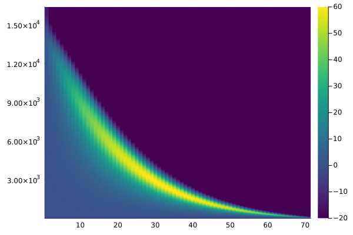
---
<a name="Sect2"></a>
[^](#top)
## Figure 2 - "One Cap" (v1) IHC Response for tone blips at 300Hz


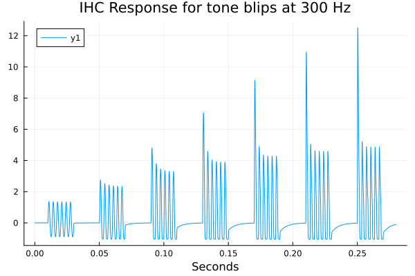
---
<a name="Sect3"></a>
[^](#top)
## Figure 3 - "One Cap" (v1) IHC Response for tone blips at 3000Hz
Same as previous, except for 3kHz instead of 300Hz.


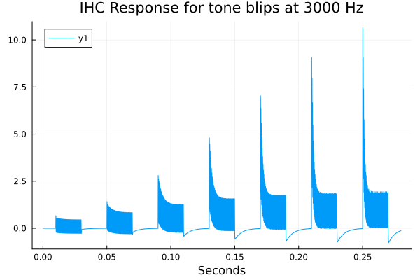
---
<a name="Sect4"></a>
[^](#top)
## Figure 4 - "Two Cap" (v2) IHC Response for tone blips at 300Hz


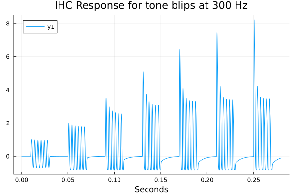
---
<a name="Sect5"></a>
[^](#top)
## Figure 5 - "Two Cap" (v2) IHC Response for tone blips at 3000Hz
Same as previous, except for 3kHz instead of 300Hz.


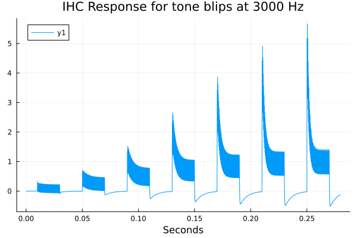
---
<a name="Sect6"></a>
[^](#top)
## Figure 6 - "do_syn" (v3) IHC Response for tone blips at 300Hz
"Two-cap version with receptor potential; slightly different blips."


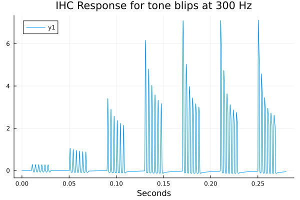
---
<a name="Sect7"></a>
[^](#top)
## Figure 7 - "do_syn" (v3) IHC Response "class_firings" for tone blips at 300Hz
Plot of "class_firings" - low, medium, high spontaneous firing rate neurons(?)


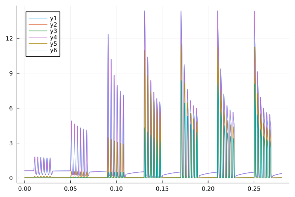
---
<a name="Sect8"></a>
[^](#top)
## Figure 8 - "do_syn" (v3) IHC Response for tone blips at 3000Hz
Same as previous, except for 3kHz instead of 300Hz.


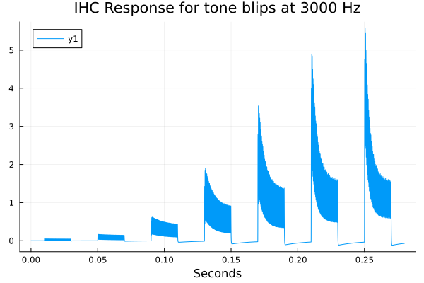
---
<a name="Sect9"></a>
[^](#top)
## Figure 9 - "do_syn" (v3) IHC "class_firings" Response for tone blips at 3000Hz
Plot of "class_firings" - low, medium, high spontaneous firing rate neurons(?)


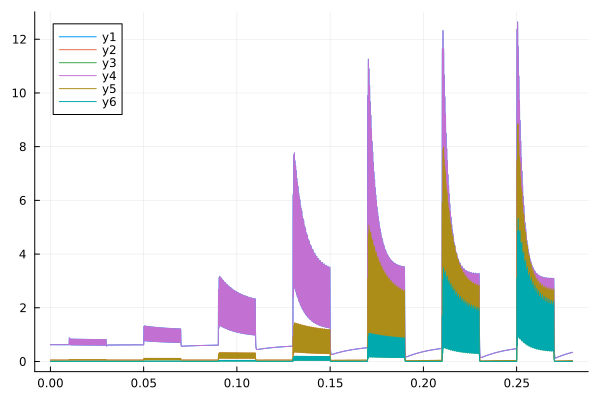
---
<a name="Sect10"></a>
[^](#top)
## Figure 10 - Steady state spatial responses of the stages, default [8, 2, 2, 2] decimation
Steady state spatial responses of the stages
With default [8, 2, 2, 2] decimation
Test: Make sure that the AGC adapts to an appropriate steady state, like [Lyon book] figure 19.7


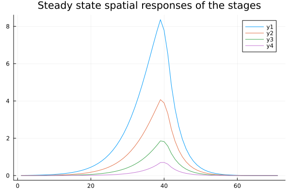
---
<a name="Sect11"></a>
[^](#top)
## Figure 11 - Steady state spatial responses of the stages, simpler [8, 1, 1, 1] decimation
Steady state spatial responses of the stages
With [8, 1, 1, 1] simpler decimation
Test: Make sure that the AGC adapts to an appropriate steady state, like [Lyon book] figure 19.7


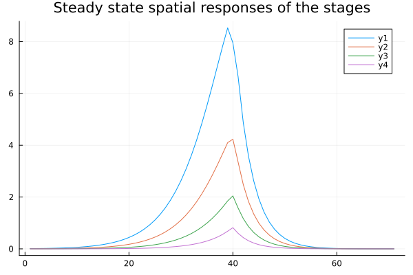
---
<a name="Sect12"></a>
[^](#top)
## Figure 12 - Steady state spatial responses of the stages, no decimation
Steady state spatial responses of the stages
With no decimation
Make sure 2025 non-decimating changes is "close enough" to same


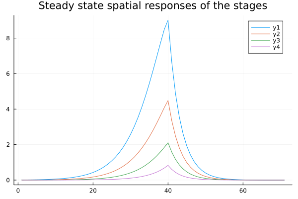
---
<a name="Sect13"></a>
[^](#top)
## Figure 13 - test stage g calculation
Make sure the quadratic stage_g calculation agrees with the ratio of polynomials from the book


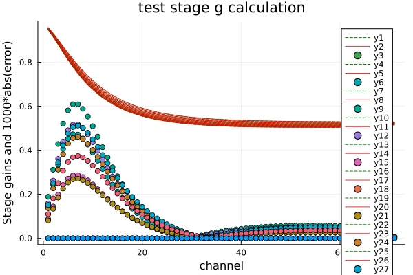
---
<a name="Sect14"></a>
[^](#top)
## Figure 14 - Whole CARFAC "one cap" (v1), decimating
Whole CARFAC v1, decimating


---
<a name="Sect15"></a>
[^](#top)
## Figure 15 - Whole CARFAC "one cap" (v1), decimating
Whole CARFAC v1, decimating


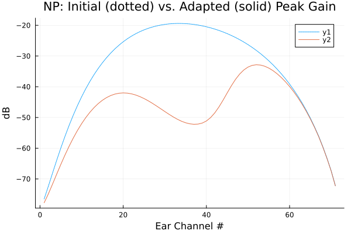
---
<a name="Sect16"></a>
[^](#top)
## Figure 16 - Whole CARFAC "one cap" (v1), decimating
Whole CARFAC v1, decimating


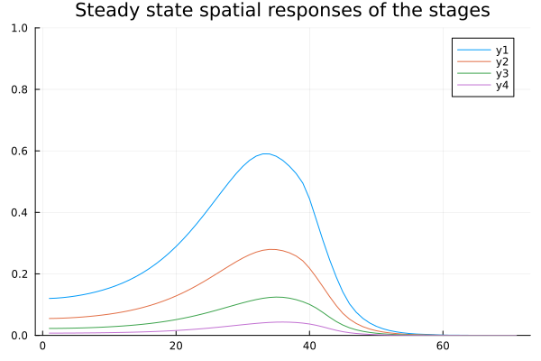
---
<a name="Sect17"></a>
[^](#top)
## Figure 17 - Whole CARFAC "two cap" (v2), decimating
Whole CARFAC v2, decimating


---
<a name="Sect18"></a>
[^](#top)
## Figure 18 - Whole CARFAC "two cap" (v2), decimating
Whole CARFAC v2, decimating


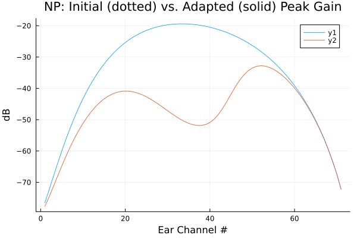
---
<a name="Sect19"></a>
[^](#top)
## Figure 19 - Whole CARFAC "two cap" (v2), decimating
Whole CARFAC v2, decimating


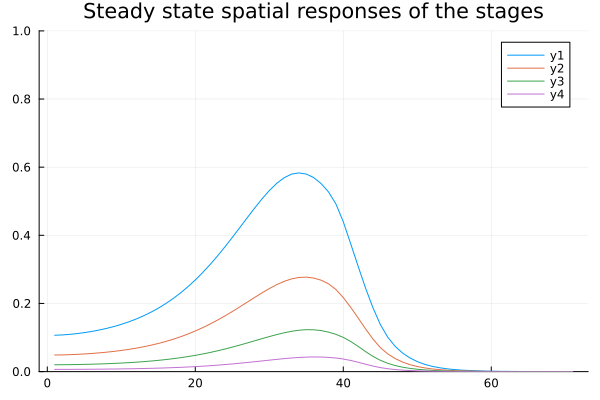
---
<a name="Sect20"></a>
[^](#top)
## Figure 20 - Whole CARFAC "do_syn"  (v3), decimating
Whole CARFAC v3, do_syn, decimating


---
<a name="Sect21"></a>
[^](#top)
## Figure 21 - Whole CARFAC "do_syn"  (v3), decimating
Whole CARFAC v3, do_syn, decimating


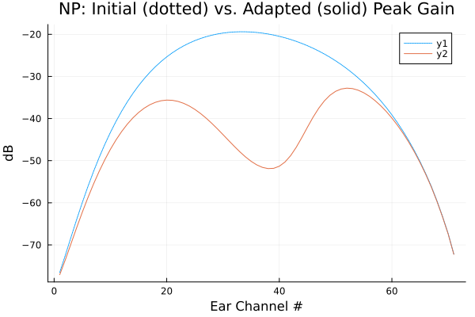
---
<a name="Sect22"></a>
[^](#top)
## Figure 22 - Whole CARFAC "do_syn"  (v3), decimating
Whole CARFAC v3, do_syn, decimating


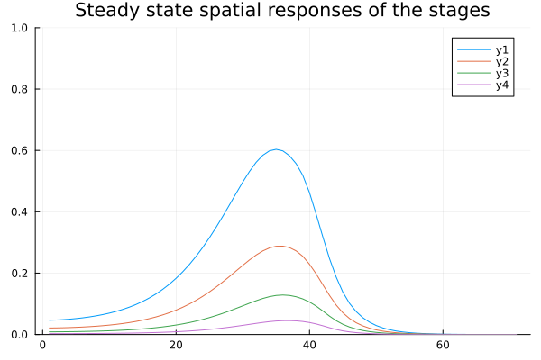
---
<a name="Sect23"></a>
[^](#top)
## Figure 23 - Whole CARFAC "one cap" (v1), non-decimating
Whole CARFAC v1, non-decimating


---
<a name="Sect24"></a>
[^](#top)
## Figure 24 - Whole CARFAC "one cap" (v1), non-decimating
Whole CARFAC v1, non-decimating


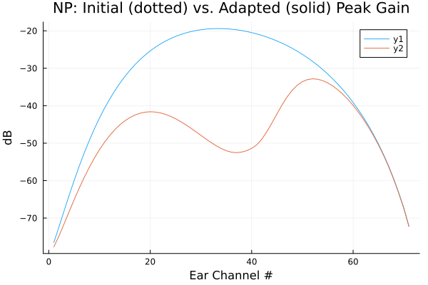
---
<a name="Sect25"></a>
[^](#top)
## Figure 25 - Whole CARFAC "one cap" (v1), non-decimating
Whole CARFAC v1, non-decimating


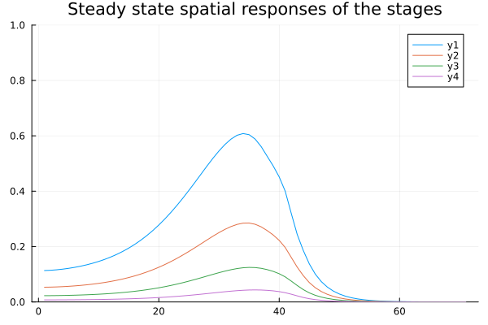
---
<a name="Sect26"></a>
[^](#top)
## Figure 26 - Whole CARFAC "two cap" (v2), non-decimating
Whole CARFAC v2, non-decimating


---
<a name="Sect27"></a>
[^](#top)
## Figure 27 - Whole CARFAC "two cap" (v2), non-decimating
Whole CARFAC v2, non-decimating


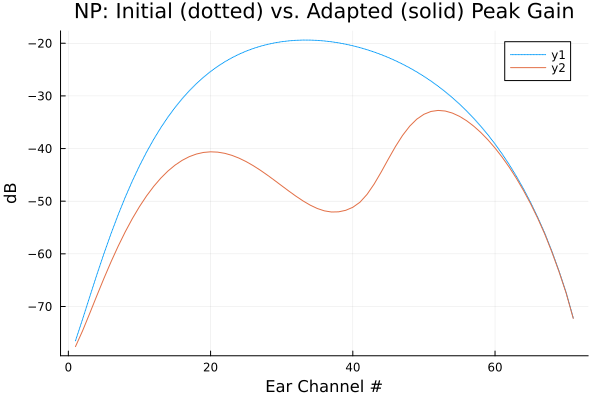
---
<a name="Sect28"></a>
[^](#top)
## Figure 28 - Whole CARFAC "two cap" (v2), non-decimating
Whole CARFAC v2, non-decimating


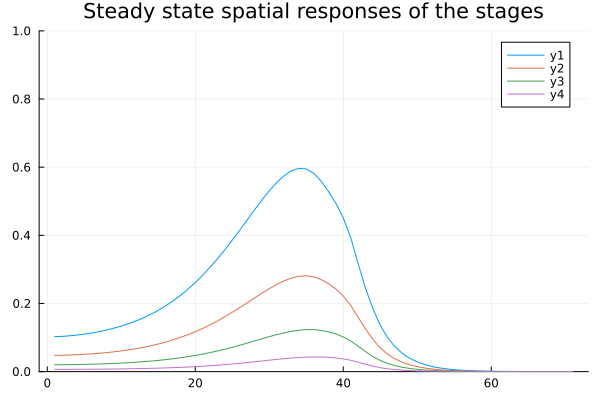
---
<a name="Sect29"></a>
[^](#top)
## Figure 29 - Whole CARFAC "do_syn"  (v3), non-decimating
Whole CARFAC v3, do_syn, non-decimating


---
<a name="Sect30"></a>
[^](#top)
## Figure 30 - Whole CARFAC "do_syn"  (v3), non-decimating
Whole CARFAC v3, do_syn, non-decimating


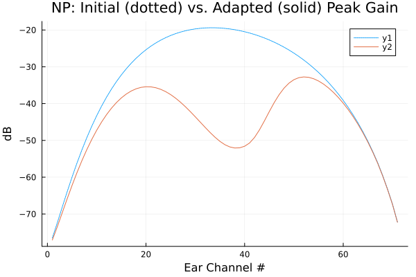
---
<a name="Sect31"></a>
[^](#top)
## Figure 31 - Whole CARFAC "do_syn"  (v3), non-decimating
Whole CARFAC v3, do_syn, non-decimating


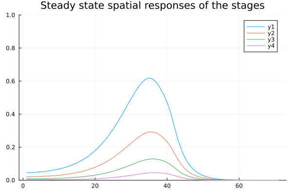
---
<a name="Sect32"></a>
[^](#top)
## Figure 32 - unhealthy hf OHC noise transfer function ratio
Verify frequency dependent reduced gain with reduced health
This test has a random component, which explains the differences between the MATLAB and Julia versions.


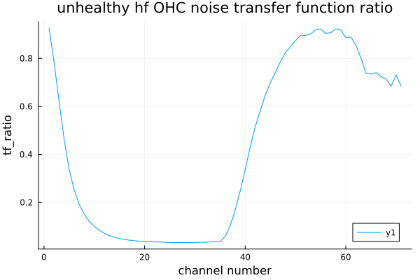
---
<a name="Sect33"></a>
[^](#top)
## Figure 33 - Spike Rates - Instantaneous
Instantaneous rates of 3 fiber-group classes


---
<a name="Sect34"></a>
[^](#top)
## Figure 34 - Spike Rates - Means
Mean rates of 3 fiber classes

This code holds the best clue to determining the input scaling - the graph is annotated with 
"10dB steps from 0 to 110dB SPL rms"

The code used to generate this input includes:

```Julia
	dbstep = 10;  # % 10 is good
	dbfs = -104:dbstep:6; # % 0 to 110 dB SPL

	t = (0:(1/fs):(duration - 1/fs)) # '; # % Sample times for short duration
	sinusoid = sin.(2 * pi * t * fp);

	for (i,db) = enumerate(dbfs)  # % Levels spanning a huge range
		amplitude = sqrt(2) * 10.0^(db/20);
                ...
        end
```
Thus 0dB SPL corresponds to `db = -104` which corresponds to an amplitude of `sqrt(2) * 10.0^(db/20)` which is 8.9e-6.

And 104dB SPL corresponds to `db = 0` which corresponds to an amplitude of `sqrt(2) * 10.0^(db/20)` which is 1.41 (ie a sinusoid with rms=1).

Other clues for scaling come from `test_multiaural_silent_channel` where:
```Julia
	amplitude = 1e-3  # % -70 dBFS, around 30-40 dB SPL

	# % c major chord of c-e-g at 523.25, 659.25 and 783.99
	# % and 32.7, 41.2 and 49
	freqs = [523.25 659.25 783.99 32.7 41.2 49]
	c_chord = amplitude * sum(sin.(2 * pi * t * freqs), dims=2)
```
In this case, the computed `amplitude` is being used to scale three sinusoids, and it is not 
clear whether the statement `around 30-40 dB SPL` refers to a single sinusoid or to the sum.

In `test_multiaural_carfac` where:
```
	amplitude = 1e-4; # % -80 dBFS, around 20 or 30 dB SPL
	noise = amplitude * randn(size(t));
```
In this cases, dBFS is referenced relative to an input with unity rms value.


Another scaling clue comes from the AMT toolbox, file `lyon2024.m`
```MATLAB
  % Level correction because CARFAC works in non-standard amplitude units.
input_waves = input_waves * sqrt(1/10); %  0 dB FS corresponds to an SPL of 104 dB

```


---
<a name="Sect35"></a>
[^](#top)
## Figure 35 - Spike Rates - agc
agc


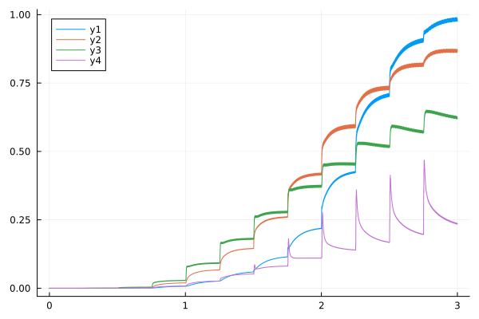
---
